<!-- README.md is generated from README.Rmd. Please edit that file -->

# Modelamiento Estadístico y Sistemas Recomendadores 

Repositorio creado para el Trabajo Final del Curso de Modelamiento
Estadístico y Sistemas Recomendadores en el programa de Diplomado en Big
Data para la toma de decisiones de la Pontificia Universidad Católica de
Chile.

**Eduardo Carrasco Vidal**

3/31/2020

<!-- badges: start -->


<!-- badges: end -->

**Requisito: Instalar las siguientes librerías**

-   *rpart*
-   *Hmisc*
-   *e1071*
-   *rminer*
-   *kknn*
-   *graphics*
-   *factoextra*
-   *NbClust*

La versión en desarrollo del documento puede instalarse desde GitHub:

``` r
# install.packages("devtools")
# devtools::install_github("educarrascov/DiploBigData")
```

# Trabajo Final:

(**Resumen General**)

En la primera parte del trabajo, se utilizaron 2 modelos de
clasificación (**Naive Bayes / K-NN**), para predecir cifosis en una
población dada; para lo cual, se generaron métricas de comparación
(Precisión, Especificidad, Sensibilidad) y una matríz de confusión.

En la segunda parte del trabajo; se utilizó un método de clustering
basado en K-means a una muestra obtenida del gasto anual en diferentes
productos.

## I. Parte Nº 1:

Considere la base de datos Kyphosis, incluída en la librería *Rpart*.
Esta base de datos contiene datos de **81 niños** a los cuales se les
realizó una cirugía correctiva en la columna vertical y se les midieron
las variables descritas en la siguiente tabla:

| variable   | descripción                                                                                       |
|------------|---------------------------------------------------------------------------------------------------|
| `Age`      | Edad en meses                                                                                     |
| `Number`   | Número de vertebras involucradas                                                                  |
| `Start`    | Número de la primera Vértebra                                                                     |
| `Kyphosis` | Indica si la persona estudiada presenta (present) o no (absent), la enfermedad denominada cifosis |

Se efectuó una simulación con la estadística descriptiva que involucra
aspectos de las 4 variables.

``` r
library(rpart) # Cargamos la librería rpart
KyphosisDatos  <-  
kyphosis # Cargamos los datos necesarios para la simulación
summary(KyphosisDatos) # Resumen de la simulación.
#>     Kyphosis       Age             Number           Start      
#>  absent :64   Min.   :  1.00   Min.   : 2.000   Min.   : 1.00  
#>  present:17   1st Qu.: 26.00   1st Qu.: 3.000   1st Qu.: 9.00  
#>               Median : 87.00   Median : 4.000   Median :13.00  
#>               Mean   : 83.65   Mean   : 4.049   Mean   :11.49  
#>               3rd Qu.:130.00   3rd Qu.: 5.000   3rd Qu.:16.00  
#>               Max.   :206.00   Max.   :10.000   Max.   :18.00
```

Podemos generar diferentes tablas de cada variables, para efectuar una
verificación inicial.

``` r
head(KyphosisDatos) #6 primero datos de todas las variables
#>   Kyphosis Age Number Start
#> 1   absent  71      3     5
#> 2   absent 158      3    14
#> 3  present 128      4     5
#> 4   absent   2      5     1
#> 5   absent   1      4    15
#> 6   absent   1      2    16
```

De igual manera, se puede observar los nombres de cada variable

``` r
names(KyphosisDatos)
#> [1] "Kyphosis" "Age"      "Number"   "Start"
```

Se genera una tabla para observar los datos de la variable kyphosis.

``` r
table(KyphosisDatos$Kyphosis)
#> 
#>  absent present 
#>      64      17
```

Se genera una tabla para observar los datos de la variable number.

``` r
table(KyphosisDatos$Number) 
#> 
#>  2  3  4  5  6  7  9 10 
#> 12 23 18 17  4  5  1  1
```

Se genera una tabla para observar los datos de la variable start.

``` r
table(KyphosisDatos$Start)
#> 
#>  1  2  3  5  6  8  9 10 11 12 13 14 15 16 17 18 
#>  5  2  3  3  4  2  4  4  3  5 12  5  7 17  4  1
```

Si se observan los comandos anteriores, podemos ver estadísticas
descriptivas de las variables como: el número total de registros
corresponde a 11, dentro de los cuales 64 presentan cifosis y 17 no
presentan; respecto a los meses, el mínimo de mes en que un niño
presenta esta enfermedad es de 1 y el máximo de 206 meses; respecto a la
variable número, el número de vértebras involucradas tiene un mínimo de
2 y un máximo de 10; por último, podemos señalar que la primera vértebra
operada en algunos casos es la 1 y en otros la 18.

La función table(), nos permite visualizar de manera general cada
variable de la base de datos pero es más usual observar la función
head(), que nos permite observar los 6 primeros valores de cada
variable.

Para observar de mejor manera el comportamiento de las variables en un
gráfico de frecuencias, podemos confeccionar un histograma, de acuerdo
al siguiente detalle:

``` r
par(mfrow=c(1,3)) #permite generar gráficos en paralelo, 1 fila por 3 columnas
hist(KyphosisDatos$Age,  main  =  "Histograma  para  Age",  xlab  =  "Age") 
hist(KyphosisDatos$Number,  main  =  "Histograma  para  Number",  xlab  =  "Number")  
hist(KyphosisDatos$Start,  main  =  "Histograma  para  Start",  xlab  =  "Start") 
```

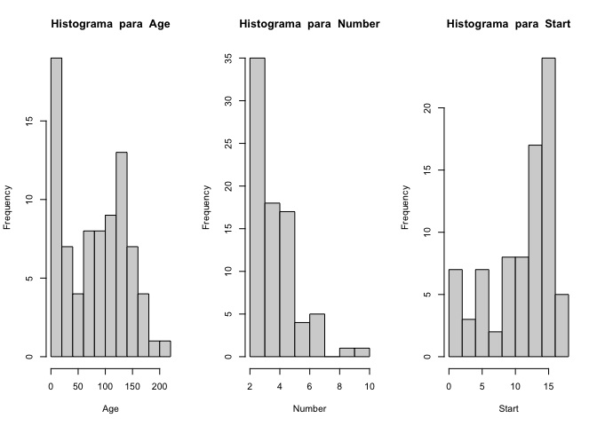<!-- -->

Si realizamos una descipción más amplia de las variables utilizando los
cuartiles, la mediana y la media aritmética, podemos determinar que la
edad promedio de los niños corresponde a 83.65 meses. Sin embargo, la
mayor cantidad de niños operados tienen entre uno y dos meses de edad,
considerando además que el 25% (1er quartil) de los niños estudiados
tienen edades hasta los 26 meses, mientras que el 75% (3er quartil) se
concentra con edades hasta los 130 meses. Respecto a la variable que
involucra el número de vértebras, el 25% (1er quartil) de los niños ha
tenido 3 mientras que el 75% (3er quartil) ha tenido hasta 5, con un
número promedio de 4.049, pero siendo 3 vértebras la cantidad más
frecuente.

Todo lo anterior se puede identificar gráficamente en los histogramas de
cada variable.

Por último, aplicamos una función que permite identificar datos
faltantes de acuerdo al siguiente detalle:

``` r
library(Hmisc)#cargamos la librería Hmisc 
#> Loading required package: lattice
#> Loading required package: survival
#> Loading required package: Formula
#> Loading required package: ggplot2
#> 
#> Attaching package: 'Hmisc'
#> The following objects are masked from 'package:base':
#> 
#>     format.pval, units
```

``` r
describe(KyphosisDatos) #verificamos que no existen datos faltantes
#> KyphosisDatos 
#> 
#>  4  Variables      81  Observations
#> --------------------------------------------------------------------------------
#> Kyphosis 
#>        n  missing distinct 
#>       81        0        2 
#>                           
#> Value       absent present
#> Frequency       64      17
#> Proportion    0.79    0.21
#> --------------------------------------------------------------------------------
#> Age 
#>        n  missing distinct     Info     Mean      Gmd      .05      .10 
#>       81        0       64        1    83.65    67.06        1        4 
#>      .25      .50      .75      .90      .95 
#>       26       87      130      158      175 
#> 
#> lowest :   1   2   4   8   9, highest: 175 177 178 195 206
#> --------------------------------------------------------------------------------
#> Number 
#>        n  missing distinct     Info     Mean      Gmd 
#>       81        0        8    0.953    4.049     1.73 
#> 
#> lowest :  2  3  4  5  6, highest:  5  6  7  9 10
#>                                                           
#> Value          2     3     4     5     6     7     9    10
#> Frequency     12    23    18    17     4     5     1     1
#> Proportion 0.148 0.284 0.222 0.210 0.049 0.062 0.012 0.012
#> --------------------------------------------------------------------------------
#> Start 
#>        n  missing distinct     Info     Mean      Gmd      .05      .10 
#>       81        0       16    0.986    11.49    5.356        1        3 
#>      .25      .50      .75      .90      .95 
#>        9       13       16       16       17 
#> 
#> lowest :  1  2  3  5  6, highest: 14 15 16 17 18
#>                                                                             
#> Value          1     2     3     5     6     8     9    10    11    12    13
#> Frequency      5     2     3     3     4     2     4     4     3     5    12
#> Proportion 0.062 0.025 0.037 0.037 0.049 0.025 0.049 0.049 0.037 0.062 0.148
#>                                         
#> Value         14    15    16    17    18
#> Frequency      5     7    17     4     1
#> Proportion 0.062 0.086 0.210 0.049 0.012
#> --------------------------------------------------------------------------------
```

Como se observa en la función anterior, no hay datos perdidos en ninguna
de las variables, por lo cual, podemos finalizar el preprocesamiento de
datos.

**1) Seleccione de manera aleatoria 2/3 de los datos para crear sus
datos de entrenamiento y guarde el tercio restante para crear los datos
de validación. Utilice la semilla 1 para el generador de números
aleatorios**:

<!-- end list -->

De acuerdo al enunciado, se generan dos bases de datos:

-   La primera para entrenamiento correspondiente a 2/3.
-   La segunda para prueba correspondiente a 1/3.

Luego, con la siguiente función observamos la cantidad de valores que se
encuentran en los nuevos Data Set.

``` r
set.seed(1) #por defecto para generar las distintas bases de datos
ind  <-  sample(2,  length(KyphosisDatos$Kyphosis),  replace=TRUE,  prob=c(2/3, 1/3)) 
#Generamos la división de datos en 2/3 y 1/3
table(ind) #cantidad de valores por dataSet
#> ind
#>  1  2 
#> 53 28
```

Los grupos anteriores se definen de la siguiente forma:

-   datos.trabajo.
-   datos.validación.

``` r
datos.trabajo  <-  KyphosisDatos[ind==1,] 
datos.validacion  <-  KyphosisDatos[ind==2,] 
```

``` r
dim(datos.trabajo) #dimensión del set de trabajo.
#> [1] 53  4
```

``` r
dim(datos.validacion) #dimensión del set de validación.
#> [1] 28  4
```

**2) Construya un clasificador de *Bayes Ingenuo* para la variable
Kyphosis. Realice las predicciones para su clasificador para los datos
de validación:**

<!-- end list -->

``` r
library(e1071) #librería sammut and web 2017, clasificadora de naive bayes
#> 
#> Attaching package: 'e1071'
#> The following object is masked from 'package:Hmisc':
#> 
#>     impute
fit.NB  <-  naiveBayes(Kyphosis  ~  .,  data=datos.trabajo, laplace = 1) 
#se asigna el clasificador a la var. fit.NB
pred.NB  <-  predict(fit.NB,  datos.validacion[,-1],  type="raw") 
#se realiza una predicción preliminar
```

Con esto observamos la probabilidad de obtener un absent o present, en
base a las otras variables, la ventaja que nos da por sobre la función
pred.NB es que esta muestra sólo los 6 primeros en la lista.

``` r
head(pred.NB)
#>         absent     present
#> [1,] 0.6180154 0.381984573
#> [2,] 0.9978356 0.002164406
#> [3,] 0.9911925 0.008807452
#> [4,] 0.5127181 0.487281903
#> [5,] 0.9967389 0.003261052
#> [6,] 0.7038583 0.296141723
```

Como lo anterior, no demuestra de manera visual lo correcto o incorrecto
que clasifica en modelo seleccionado, sólo entrega una probabilidad de
ser clasificado como cifosis ausente o presente, lo correcto es aplicar
o ejecutar una función para conocer las métricas, de acuerdo a lo
siguiente:

``` r
library(rminer) 
#esta función permite abrir la libreria rminer y poder medir las métricas
mmetric(datos.validacion[,1],  pred.NB,  "ACC") 
#> [1] 85.71429
#precisiòn, ref. a Accuracy.
```

``` r
mmetric(datos.validacion[,1],  pred.NB,  "TPR") 
#> [1] 95.45455 50.00000
#sensibilidad, ref. a True Possitive Rate.
```

``` r
mmetric(datos.validacion[,1],  pred.NB,  "TNR") 
#> [1] 50.00000 95.45455
#Especificidad, ref. a True Negative Rate.
```

``` r
print(pred.NB.Conf  <-  mmetric(datos.validacion[,1],  pred.NB,  "CONF")) 
#> $res
#> NULL
#> 
#> $conf
#>          pred
#> target    absent present
#>   absent      21       1
#>   present      3       3
#> 
#> $roc
#> NULL
#> 
#> $lift
#> NULL
#permite hacer la matríz de confusión
```

``` r
print(pred.NB.Conf  <-  mmetric(datos.validacion[,1],  pred.NB,  "AUC"))
#> [1] 0.8106061
#Permite obtener el área bajo la curva ROC (Area Under Curve)
```

Con esta función podemos incluso obtener una matríz de confusión que
permite efectuar el cálculo manual de cada uno de los parámetros
anteriormente determinados.

``` r
ctable <- as.table(matrix(c(21,1,3,3), nrow = 2, byrow = TRUE)) 
#se deben colocar los valores obtenidos en la matriz
fourfoldplot(ctable, color = c("#CC6666", "#99CC99"),conf.level = 0, margin = 1, main = "Matriz de Confusión - Naive Bayes")
```

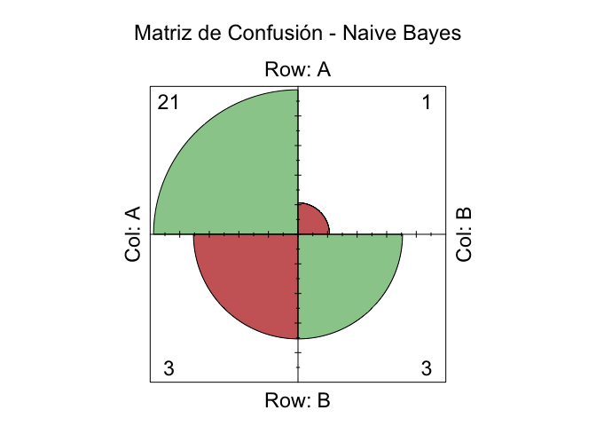<!-- --> Efectuada la
confección de la matriz de confusión y en base a los códigos ejecutados,
se puede comparar con las verdaderas clases asociadas a cada entrada
para así obtener indicadores cuantitativos respecto al desempeño del
modelo.

Para lo anterior, se determinaron las siguientes métricas:

| Métrica         | Descripción                              |
|-----------------|------------------------------------------|
| `Precisión`     | (**ACC** - Classification Accuracy Rate) |
| `Sensibilidad`  | (**TPR** - True Positive Rate)           |
| `Especificidad` | (**TNR** - True Negative Rate)           |

Si se observan los resultados obtenidos, vemos por un lado que la
**`Precisión`** (**ACC - Clasification Accuraccy Rate**) del modelo es
de **85.71%**.

Respecto a la variable **`Sensibilidad`** (**TPR - True Possitive
Rate**), esta se puede calcular en forma manual de acuerdo a los
resultados obtenidos por la matríz de confusión, que tiene la siguiente
estructura:


$$ TPR = \\frac{TP}{(TP + FP)} $$

$$ TPR = \\frac{21}{(21+1)} = 95,45% $$

Respecto a la variable **`Especificidad`** (**TNR - True Negative
Rate**), esta se puede calcular en forma manual de acuerdo a los
resultados obtenidos por la matríz de confusión, que tiene la siguiente
estructura:

$$ TNR =\\frac{TN}{(TN + FN)} $$

$$ TNR =\\frac{3}{(3+3)} = 50,00% $$

De acuerdo a los resultados anteriores, podemos concluir que existe una
mayor probabilidad de que el clasificador efectúe una clasificación
positiva (absent) cuando las variables de entrada tienen características
de positivas (absent), llegando a un 95,45% (sensibilidad), lo cual se
puede observar en la matríz de confusión. Por otro lado, existe una
menor probabilidad de ser clasificado con una clasificación negativa
(present) puesto que de los resultados, no hay realmente una distinción
entre los verdaderos negativos y los falsos negativos, lo cual nos
entrega una probabilidad de clasificación negativa (especificidad) de un
50%.

El marcador global o `Precisión` (**ACC - Classification Accuracy
Rate**) del clasificador, se puede determinar por la siguiente formula:

$$ ACC =\\frac{(TP + TN)}{(TP + FP + TN + FN)} $$

$$ ACC =\\frac{(21 + 3)}{(21 + 1 + 3 + 3)}= 85,71 $$

**3) Construya un clasificador de *k-vecinos más cercanos (KNN)* para la
variable Kyphosis. Realice las predicciones para su clasificador para
los datos de validación:**

<!-- end list -->

``` r
library(kknn) #cargamos la librería del KNN 
fit.kknn<-kknn(Kyphosis~.,datos.trabajo,datos.validacion,distance= 1,kernel="triangular") 
#efectuamos una predicción utilizando el algoritmo KNN 
```

Como lo anterior, no demuestra de manera visual lo correcto o incorrecto
que clasifica en modelo seleccionado, sólo entrega una probabilidad de
ser clasificado como cifosis ausente (absent) o presente (present), lo
correcto es aplicar o ejecutar una función para conocer las métricas, de
acuerdo a lo siguiente:

``` r
head(fit.kknn)
#> $fitted.values
#>  [1] absent  absent  absent  present absent  absent  absent  absent  absent 
#> [10] absent  absent  absent  absent  absent  absent  present absent  absent 
#> [19] absent  absent  absent  absent  absent  absent  absent  absent  absent 
#> [28] present
#> Levels: absent present
#> 
#> $CL
#>       [,1]      [,2]      [,3]      [,4]      [,5]      [,6]      [,7]     
#>  [1,] "absent"  "present" "present" "absent"  "absent"  "absent"  "absent" 
#>  [2,] "absent"  "absent"  "absent"  "absent"  "absent"  "absent"  "absent" 
#>  [3,] "absent"  "absent"  "absent"  "absent"  "absent"  "absent"  "absent" 
#>  [4,] "present" "present" "absent"  "absent"  "absent"  "absent"  "absent" 
#>  [5,] "absent"  "absent"  "absent"  "absent"  "absent"  "absent"  "absent" 
#>  [6,] "absent"  "absent"  "present" "present" "present" "absent"  "absent" 
#>  [7,] "absent"  "absent"  "absent"  "absent"  "present" "absent"  "absent" 
#>  [8,] "absent"  "absent"  "absent"  "absent"  "absent"  "absent"  "absent" 
#>  [9,] "absent"  "absent"  "absent"  "absent"  "absent"  "absent"  "absent" 
#> [10,] "absent"  "absent"  "absent"  "absent"  "absent"  "absent"  "absent" 
#> [11,] "absent"  "absent"  "absent"  "present" "present" "absent"  "absent" 
#> [12,] "absent"  "absent"  "absent"  "absent"  "absent"  "absent"  "present"
#> [13,] "absent"  "absent"  "absent"  "absent"  "absent"  "absent"  "absent" 
#> [14,] "absent"  "present" "absent"  "absent"  "absent"  "absent"  "absent" 
#> [15,] "absent"  "absent"  "present" "absent"  "present" "absent"  "present"
#> [16,] "present" "present" "present" "present" "present" "present" "absent" 
#> [17,] "absent"  "present" "absent"  "absent"  "absent"  "absent"  "absent" 
#> [18,] "absent"  "present" "absent"  "absent"  "absent"  "present" "present"
#> [19,] "absent"  "absent"  "absent"  "absent"  "absent"  "absent"  "absent" 
#> [20,] "absent"  "absent"  "absent"  "absent"  "absent"  "absent"  "absent" 
#> [21,] "absent"  "present" "absent"  "absent"  "present" "absent"  "present"
#> [22,] "absent"  "absent"  "absent"  "absent"  "absent"  "absent"  "absent" 
#> [23,] "absent"  "absent"  "absent"  "absent"  "absent"  "absent"  "absent" 
#> [24,] "absent"  "absent"  "absent"  "absent"  "absent"  "present" "present"
#> [25,] "absent"  "absent"  "absent"  "absent"  "absent"  "absent"  "absent" 
#> [26,] "absent"  "absent"  "absent"  "absent"  "present" "absent"  "absent" 
#> [27,] "absent"  "absent"  "absent"  "absent"  "absent"  "present" "absent" 
#> [28,] "absent"  "present" "present" "present" "absent"  "present" "present"
#> 
#> $W
#>            [,1]      [,2]      [,3]       [,4]       [,5]       [,6]
#>  [1,] 0.4485108 0.4450164 0.3452969 0.33043512 0.19873181 0.09584036
#>  [2,] 0.8744251 0.6721031 0.4607732 0.38625296 0.32908293 0.31443517
#>  [3,] 0.4304574 0.3804622 0.3185577 0.26063813 0.20271855 0.05791958
#>  [4,] 0.5012964 0.4256791 0.3779405 0.23907544 0.11444336 0.07761931
#>  [5,] 0.5517115 0.4066061 0.2562725 0.24852835 0.23425036 0.18789172
#>  [6,] 0.6351680 0.5613301 0.5432748 0.49862974 0.24212931 0.18747043
#>  [7,] 0.7137904 0.5684163 0.5586076 0.08022646 0.05660611 0.04099157
#>  [8,] 0.7688476 0.6523381 0.3984750 0.34823112 0.08710976 0.06253251
#>  [9,] 0.6463836 0.5229362 0.4570021 0.39106804 0.36712194 0.07747150
#> [10,] 0.9555801 0.7160221 0.6002208 0.51138101 0.42939245 0.28051736
#> [11,] 0.6171410 0.6056638 0.3740641 0.35110970 0.29783467 0.04590884
#> [12,] 0.9264879 0.6508175 0.5405494 0.42369838 0.25729236 0.16311461
#> [13,] 0.4893207 0.4168417 0.2658157 0.16777661 0.11122883 0.02976159
#> [14,] 0.3646163 0.2662728 0.1840249 0.13424859 0.08568137 0.08118681
#> [15,] 0.6929483 0.6639899 0.4071096 0.17025608 0.16651079 0.13456382
#> [16,] 0.7036253 0.3723702 0.3451823 0.17353398 0.16397439 0.12393924
#> [17,] 0.3708547 0.3005982 0.2968790 0.23643863 0.14779325 0.08921251
#> [18,] 0.6730640 0.5158399 0.4526270 0.27291703 0.12569103 0.03772281
#> [19,] 0.5724059 0.5464689 0.5369209 0.25473164 0.24974577 0.24822507
#> [20,] 0.9358558 0.4997498 0.4431279 0.37146143 0.31648073 0.17410557
#> [21,] 0.7172668 0.7073632 0.6018655 0.45655334 0.25181607 0.17990539
#> [22,] 0.4709196 0.4221094 0.4192575 0.41925748 0.23840467 0.22620212
#> [23,] 0.5316598 0.3328765 0.2843429 0.23833058 0.08808088 0.06606066
#> [24,] 0.3639325 0.3080602 0.3072973 0.29332926 0.19381415 0.08630997
#> [25,] 0.6317083 0.5929408 0.3545989 0.35459888 0.30044846 0.25768002
#> [26,] 0.8287319 0.4082231 0.2852510 0.10098751 0.04900577 0.01836006
#> [27,] 0.6281424 0.4485468 0.3361273 0.15653167 0.14455725 0.10586675
#> [28,] 0.6827598 0.4725141 0.4508533 0.32871082 0.29460599 0.23651680
#>               [,7]
#>  [1,] 0.0611525288
#>  [2,] 0.2281596933
#>  [3,] 0.0136382150
#>  [4,] 0.0073224883
#>  [5,] 0.0363001530
#>  [6,] 0.0493153935
#>  [7,] 0.0386991416
#>  [8,] 0.0502438816
#>  [9,] 0.0005484255
#> [10,] 0.2657107285
#> [11,] 0.0338588404
#> [12,] 0.0495550445
#> [13,] 0.0255601316
#> [14,] 0.0754373889
#> [15,] 0.0425364407
#> [16,] 0.0750899581
#> [17,] 0.0231933714
#> [18,] 0.0090817374
#> [19,] 0.0539877375
#> [20,] 0.0728071127
#> [21,] 0.1775234610
#> [22,] 0.0538475122
#> [23,] 0.0640888033
#> [24,] 0.0164696679
#> [25,] 0.1384352181
#> [26,] 0.0153228518
#> [27,] 0.0759973770
#> [28,] 0.1327459512
#> 
#> $D
#>             [,1]      [,2]      [,3]      [,4]      [,5]      [,6]      [,7]
#>  [1,] 1.71330877 1.7241650 2.0339629 2.0801340 2.4892961 2.8089484 2.9167130
#>  [2,] 0.24172123 0.6311743 1.0379669 1.1814122 1.2914598 1.3196555 1.4857286
#>  [3,] 1.08213444 1.1771256 1.2947446 1.4047921 1.5148397 1.7899586 1.8740935
#>  [4,] 1.31737245 1.5171228 1.6432286 2.0100538 2.3392811 2.4365553 2.6222510
#>  [5,] 0.81358517 1.0769325 1.3497684 1.3638230 1.3897357 1.4738706 1.7489895
#>  [6,] 0.74122190 0.8912368 0.9279193 1.0186239 1.5397506 1.6508000 1.9314868
#>  [7,] 0.53518142 0.8070155 0.8253568 1.7198784 1.7640460 1.7932435 1.7975301
#>  [8,] 0.40679258 0.6118313 1.0585912 1.1470127 1.6065460 1.6497982 1.6714243
#>  [9,] 0.59020520 0.7962457 0.9062933 1.0163408 1.0563082 1.5397506 1.6681395
#> [10,] 0.05502379 0.3517688 0.4952141 0.6052616 0.7068224 0.8912368 0.9095781
#> [11,] 0.61183129 0.6301726 1.0002826 1.0369651 1.1221018 1.5246942 1.5439508
#> [12,] 0.07336505 0.3484840 0.4585315 0.5751488 0.7412219 0.8352113 0.9485437
#> [13,] 0.79852873 0.9118611 1.1480145 1.3013142 1.3897357 1.5171228 1.5236924
#> [14,] 1.19975344 1.3854491 1.5407524 1.6347418 1.7264481 1.7349349 1.7457911
#> [15,] 0.77790442 0.8512695 1.5020663 2.1021260 2.1116146 2.1925511 2.4256991
#> [16,] 1.37467928 2.9111451 3.0372509 3.8334101 3.8777505 4.0634462 4.2900245
#> [17,] 1.11133196 1.2354342 1.2420038 1.3487666 1.5053512 1.6088291 1.7254463
#> [18,] 0.81458695 1.2063231 1.3638230 1.8115847 2.1784100 2.3975898 2.4689512
#> [19,] 0.92363274 0.9796583 1.0002826 1.6098309 1.6206007 1.6238855 2.0434515
#> [20,] 0.12838883 1.0012844 1.1146168 1.2580621 1.3681096 1.6530830 1.8558387
#> [21,] 0.89872182 0.9302024 1.2655471 1.7274499 2.3782467 2.6068286 2.6144001
#> [22,] 0.79524391 0.8686090 0.8728956 0.8728956 1.1447297 1.1630709 1.4221316
#> [23,] 0.78018747 1.1113320 1.1921820 1.2688319 1.5191263 1.5558088 1.5590937
#> [24,] 0.83521126 0.9085763 0.9095781 0.9279193 1.0585912 1.1997534 1.2914598
#> [25,] 0.69696795 0.7703330 1.2213795 1.2213795 1.3238557 1.4047921 1.6304552
#> [26,] 0.24172123 0.8352113 1.0087694 1.2688319 1.3421969 1.3854491 1.3897357
#> [27,] 0.53846624 0.7985287 0.9613170 1.2213795 1.2387190 1.2947446 1.3379968
#> [28,] 0.83521126 1.3887339 1.4457613 1.7673308 1.8571200 2.0100538 2.2832556
#> 
#> $C
#>       [,1] [,2] [,3] [,4] [,5] [,6] [,7]
#>  [1,]   28   16   25   42   18   17   45
#>  [2,]   34   11   51   21    5   37    4
#>  [3,]   34    6    5   21   29   24   20
#>  [4,]   16   25   28   42   18   45   17
#>  [5,]    9    2   46   43   20   24   29
#>  [6,]   36   12    8    7   26   49   32
#>  [7,]   48   31   23   35   26   30    2
#>  [8,]   45   47   53   10   32   18   27
#>  [9,]   34   21    5   11   51   27   37
#> [10,]   11   51   21    5   37   34    4
#> [11,]   31   23   48   38   26   35   32
#> [12,]   29   24   43   19   49   40   14
#> [13,]   18   37   45   10   47   27   51
#> [14,]   39    7   45   52   17   32   47
#> [15,]   42   28   25   32   13    1   38
#> [16,]   33   41   13   16    3   38   39
#> [17,]   22   14    2   40    9   19   43
#> [18,]   15    3    1   42   28   38   14
#> [19,]   20    2   46    9    6   22   19
#> [20,]   34   11   51   21    5   37    4
#> [21,]   42    3   28   15   38    1   13
#> [22,]   35   30    2   48   31   23   44
#> [23,]   17    4   12   36   11   21   51
#> [24,]   30   35   23   31   44   14   26
#> [25,]   35   30    2   48   44    9   50
#> [26,]    2    9   40   19   14   43   35
#> [27,]   22    6   40   19   20   14   43
#> [28,]   39   16   25   41   52   13    7
#> 
#> $prob
#>           absent    present
#>  [1,] 0.58944422 0.41055578
#>  [2,] 1.00000000 0.00000000
#>  [3,] 1.00000000 0.00000000
#>  [4,] 0.46828731 0.53171269
#>  [5,] 1.00000000 0.00000000
#>  [6,] 0.52746274 0.47253726
#>  [7,] 0.97248574 0.02751426
#>  [8,] 1.00000000 0.00000000
#>  [9,] 1.00000000 0.00000000
#> [10,] 1.00000000 0.00000000
#> [11,] 0.72095388 0.27904612
#> [12,] 0.98354481 0.01645519
#> [13,] 1.00000000 0.00000000
#> [14,] 0.77651708 0.22348292
#> [15,] 0.72950841 0.27049159
#> [16,] 0.03835591 0.96164409
#> [17,] 0.79480928 0.20519072
#> [18,] 0.73039785 0.26960215
#> [19,] 1.00000000 0.00000000
#> [20,] 1.00000000 0.00000000
#> [21,] 0.63240792 0.36759208
#> [22,] 1.00000000 0.00000000
#> [23,] 1.00000000 0.00000000
#> [24,] 0.93450244 0.06549756
#> [25,] 1.00000000 0.00000000
#> [26,] 0.97127248 0.02872752
#> [27,] 0.94415632 0.05584368
#> [28,] 0.37609701 0.62390299
```

``` r
fit  <-  fitted(fit.kknn) 
#esto lo utilizamos para verificar el desempeño del ajuste del algoritmo
table(datos.validacion$Kyphosis,fit) 
#>          fit
#>           absent present
#>   absent      20       2
#>   present      5       1
#con esto verificamos lo ajustado graficamente con una matriz de confusión
```

``` r
ctable1 <- as.table(matrix(c(20,2,5,1), nrow = 2, byrow = TRUE)) 
#se deben colocar los valores obtenidos en la matriz
mmetric(datos.validacion$Kyphosis,fit,"ACC")
#> [1] 75
#Obtenemos la métrica, Accuracy, precisión.
```

``` r
mmetric(datos.validacion$Kyphosis,fit,"TPR")
#> [1] 90.90909 16.66667
```

``` r
mmetric(datos.validacion$Kyphosis,fit,"TNR")
#> [1] 16.66667 90.90909
```

Con esta función podemos incluso obtener una matríz de confusión que
permite efectuar el cálculo manual de cada uno de los parámetros
anteriormente determinados:

``` r
fourfoldplot(ctable1, color = c("#CC6666", "#99CC99"),conf.level = 0, margin = 1, main = "Matriz de confusión - K-Nearest Neighbors")
```

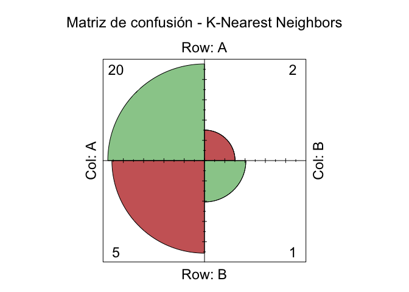<!-- --> Efectuada la
confección de la matriz de confusión y en base a los códigos ejecutados,
se puede comparar con las verdaderas clases asociadas a cada entrada
para así obtener indicadores cuantitativos respecto al desempeño del
modelo.

Para lo anterior, se determinaron las siguientes métricas:

| Métrica         | Descripción                          |
|-----------------|--------------------------------------|
| `Precisión`     | (ACC - Classification Accuracy Rate) |
| `Sensibilidad`  | (TPR - True Positive Rate)           |
| `Especificidad` | (TNR - True Negative Rate)           |

Si se observan los resultados obtenidos, vemos por un lado que la
precisión del modelo es de **75,00%**.

Respecto a la variable `Sensibilidad` (**TPR - True Possitive Rate**),
esta se puede calcular en forma manual de acuerdo a los resultados
obtenidos por la matríz de confusión, que tiene la siguiente estructura:

$$ TPR = \\frac{20}{(20+2)} = 90,90% $$

Respecto a la variable `Especificidad` (**TNR - True Negative Rate**),
esta se puede calcular en forma manual de acuerdo a los resultados
obtenidos por la matríz de confusión, que tiene la siguiente estructura:

$$ TNR =\\frac{1}{(1+5)} = 16,66% $$

De acuerdo a los resultados anteriores, podemos concluir que existe una
mayor probabilidad de que el clasificador efectúe una clasificación
positiva (absent) cuando las variables de entrada tienen características
de positivas (absent), llegando a un **90,90%** (`Sensibilidad`), lo
cual se puede observar en la matríz de confusión. Por otro lado, existe
una probabilidad casi nula de ser clasificado con una clasificación
negativa (present), afectando gravemente al clasificador, lo cual nos
entrega una probabilidad de clasificación negativa (`Especificidad`) de
un **16,66%**.

El marcador global o `Precisión` (**ACC - Clasification Accuracy Rate**)
del clasificador, se puede determinar por la siguiente formula:

$$ ACC=\\frac{(20 + 1)}{(20+ 2 + 1 + 5)}= 75,00% $$

**4) Compare los clasificadores respecto de su sensibilidad,
especificidad y precisión:**

Para efectuar esta comparación, efectuaremos primero una comparación
entre ambas matrices de confusión: <!-- end list -->

``` r
par(mfrow=c(1,2))
#con esto nos permite generar 1 fila con 2 columnas
fourfoldplot(ctable, color = c("#CC6666", "#99CC99"),conf.level = 0, margin = 1, main = "Naive Bayes", )
fourfoldplot(ctable1, color = c("#CC6666", "#99CC99"),conf.level = 0, margin = 1, main = "K-Nearest Neighbors", )
```

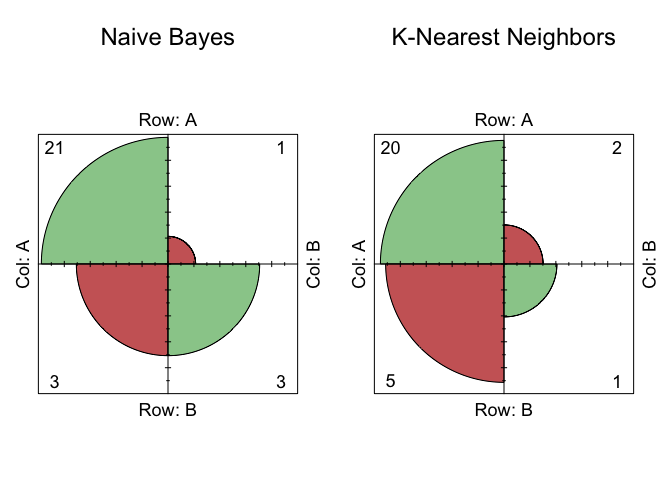<!-- --> Analizada la
matriz de confusión en base a los **TP** y **TN** (círculos verdes),
podemos observar que mayoritariamente en la matriz Naive Bayes existe
una mayor cantidad de valores positivos (**absent**) que fueron
efectivamente determinados por el modelo como valores positivos, por lo
cual, la variable `Sensibilidad` (**True Positive Rate**), debería ser
más grande en Naive Bayes, lo cual se condice con la respuesta obtenida
(**95.45 % Naive Bayes / 90.90 % K-NN**).

Respecto a los valores negativos (**present**) que fueron efectivamente
determinados por el modelo como negativo, variable `Especificidad`
(**True Negative Rate**), podemos observar que mayoritariamente también
en el clasificador Naive Bayes, existe una mayor cantidad, lo cual se
observa en los valores reales obtenidos (**50.0 Naive Bayes / 16.66
K-NN**).

Por último, podemos señalar la medida global de efectividad que
involucra la suma de ambos valores de predicción correcta (TP, TN)
divididos por la suma de todos los valores (TP, TN, FP, FN); que en
clasificador Naive Bayes=24 y en el clasificador Knn=21, estos divididos
por el total de valores (Test Set) = 28, se obtiene una `Precisión`
(**Classification Accuracy Rate**) mayor para el Naive Bayes (**85.71 %
Naive bayes / 75.00 % K-NN**).

## II. Parte Nº 2:

Considere los datos “wholesale.csv”, que contiene información de 440
clientes de un distribuidor mayorista. La base de datos contiene
información sobre el gasto anual de cada cliente en productos en las
siguientes categorías: frescos (fresh), lácteos (milk), comestibles
(grocery), congelados (frozen), detergentes/papel (detergents_paper) y
rotisería (delicatessen).

| variable           | descripción            |
|--------------------|------------------------|
| `fresh`            | Productos frescos      |
| `milk`             | Productos lacteos      |
| `Grocery`          | Productos Comestibles  |
| `frozen`           | Productos Congelados   |
| `detergents_paper` | Detergentes y papeles  |
| `delicatessen`     | Productos de Rotisería |

La estadística descriptiva obtenida a través del ingreso de códigos, se
observa en el siguiente cuadro:

``` r
Datos_Wholesale<-  read.table("data/wholesale.csv",header=TRUE,  sep=",")
summary(Datos_Wholesale)
#>      Fresh             Milk          Grocery          Frozen       
#>  Min.   :     3   Min.   :   55   Min.   :    3   Min.   :   25.0  
#>  1st Qu.:  3128   1st Qu.: 1533   1st Qu.: 2153   1st Qu.:  742.2  
#>  Median :  8504   Median : 3627   Median : 4756   Median : 1526.0  
#>  Mean   : 12000   Mean   : 5796   Mean   : 7951   Mean   : 3071.9  
#>  3rd Qu.: 16934   3rd Qu.: 7190   3rd Qu.:10656   3rd Qu.: 3554.2  
#>  Max.   :112151   Max.   :73498   Max.   :92780   Max.   :60869.0  
#>  Detergents_Paper    Delicassen     
#>  Min.   :    3.0   Min.   :    3.0  
#>  1st Qu.:  256.8   1st Qu.:  408.2  
#>  Median :  816.5   Median :  965.5  
#>  Mean   : 2881.5   Mean   : 1524.9  
#>  3rd Qu.: 3922.0   3rd Qu.: 1820.2  
#>  Max.   :40827.0   Max.   :47943.0
```

Podemos observar que no existen datos faltantes en ninguno de los seis
atributos, y que estos corresponden a variables numéricas que simbolizan
el gastos en dólares en cada ítem.

Al analizar los datos de gastos anuales de los **440 clientes** en las
distintas categorías se tiene que, a nivel promedio, los `fresh`
corresponden a los gastos más altos por **12000 USD** mientras que el
menor gasto promedio es para los productos de `delicatessen`, donde el
monto promedio es de **1524,9 USD**. Respecto a los mínimos, se tiene
que 3USD es el gasto mínimo realizado en los `fresh`, `Grocery`,
`detergents_paper` y `delicatessen`. A nivel de máximos gastos
realizados, se tiene registro de gastos por 112.151 USD en productos
catalogados como `fresh` y 92.780 USD para los `Grocery`. Al revisar los
gastos a nivel de cuartiles para los productos, se puede indicar que
para los productos frescos que son los con mayor promedio de gastos
anuales, se tiene que el **25%** gasta hasta **3.128 USD** y el 75% de
los clientes gasta anualmente 16.934 USD. Para el caso de los
comestibles, se tiene que el 25% gasta hasta 2.153 USD y el 75% de los
clientes gasta anualmente 10.656 USD. Para el caso de los productos de
rotisería que en promedio son los de más bajo gasto anual, se tiene que
el 25% gasta hasta 408,2 USD y el 75% de los clientes gasta anualmente
1.820 USD.

Cargamos la librería graphics y generamos histogramas de cada variable.

``` r
library(graphics) 
par(mfrow=c(2,3))
hist(Datos_Wholesale$Fresh,  main  =  "Hist.Fresh",  xlab  =  "Fresh") 
hist(Datos_Wholesale$Milk,  main  =  "Hist. Milk",  xlab  =  "Milk") 
hist(Datos_Wholesale$Grocery,  main  =  "Hist. Grocery",  xlab  = "Grocery")
hist(Datos_Wholesale$Frozen,  main  =  "Hist. Frozen",  xlab  =  "Frozen") 
hist(Datos_Wholesale$Detergents_Paper,  main  =  "Hist. Detergents_Paper",  xlab  =  "Detergents_Paper")
hist(Datos_Wholesale$Delicassen,  main  =  "Hist. Delicassen",  xlab  = "Delicassen")
```

<!-- -->

**a) Utilizando K-means, agrupe las observaciones en k grupos, con
k=1,…,10 y determine la suma de las variaciones dentro de cada grupo de
k:**

Para realizar los agrupamientos o segmentaciones (generar clúster), se
usará la función kmeans () donde 𝑘 es el número de clusters fijado,
estos simbolizan que los objetos pertenecientes a cada grupo (clúster),
estén relacionados de mejor manera entre sí, comparados con objetos
asignados en otros grupos.

``` r
D1=kmeans(Datos_Wholesale, 1)
D2=kmeans(Datos_Wholesale, 2)
D3=kmeans(Datos_Wholesale, 3)
D4=kmeans(Datos_Wholesale, 4)
D5=kmeans(Datos_Wholesale, 5)
D6=kmeans(Datos_Wholesale, 6)
D7=kmeans(Datos_Wholesale, 7)
D8=kmeans(Datos_Wholesale, 8)
D9=kmeans(Datos_Wholesale, 9)
D10=kmeans(Datos_Wholesale, 10)
```

Una vez generados los segmentos o grupos, desde el D1 al D10 que
simbolizan los k=1,…,10, podemos obtener las características de cada uno
de ellos mediante los siguientes códigos:

``` r
D1$withinss
#> [1] 157595857166
D1$size
#> [1] 440
D2$withinss
#> [1] 60341401922 52876126599
D2$size
#> [1] 375  65
D3$withinss
#> [1] 25765310312 28184318853 26382784678
D3$size
#> [1]  60 330  50
D4$withinss
#> [1] 10434501379 18817881659 20922612343 14680550147
D4$size
#> [1]  95 276  58  11
D5$withinss
#> [1] 16226867469 10804478229 11008166107  9394958498  5682449098
D5$size
#> [1]  24 227  71 113   5
D6$withinss
#> [1]  8088683561  7712921887  5506675575  5682449098  5004238144 15503545227
D6$size
#> [1] 191 100  93   5  30  21
D7$withinss
#> [1]  5004238144  4685567877  5981794020  5682449098 10554328802  4964567810
#> [7]  5049789976
D7$size
#> [1]  30 155 110   5   8  45  87
D8$withinss
#> [1] 1591649631 4553210633 4685567877 5682449098 5004238144 3724770614 5981794020
#> [8] 5049789976
D8$size
#> [1]   2  44 155   5  30   7 110  87
D9$withinss
#> [1] 5682449098 4002824206 3540999426 6497685821 4842775692 2272986543 4820212592
#> [8] 1611716058 3219039691
D9$size
#> [1]   5  97  66   3  85 110  29  24  21
D10$withinss
#>  [1] 1657529737 5004238144 1473987720 5682449098 3147790590 1529355410
#>  [7] 1591649631 3367428658 4964794992 2662575437
D10$size
#>  [1]   3  30  26   5 139  19   2  41  85  90
```

Podemos visualizar gráficamente los clústers usando la función
fviz_cluster() de la librería factoextra. Así, por ejemplo, para 𝑘 = 3,
𝑘 = 5 y 𝑘 = 9 las gráficas son respectivamente las que se muestran
abajo. Estas gráficas nos mostrarán los dos componentes principales
(variables más significativas), por cada agrupación.

``` r
library(factoextra)
#> Welcome! Want to learn more? See two factoextra-related books at https://goo.gl/ve3WBa
fviz_cluster  (D3,  Datos_Wholesale,  geom  =  "point", 
               stand  =FALSE, ellipse.type =  "Euclid", pointsize = 1.3, 
               labelsize = 15, main = "Ploteo de Clúster en D3", 
               xlab = NULL, ylab = NULL, ggtheme = theme_linedraw())
```

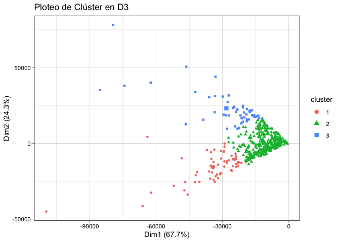<!-- -->

``` r
fviz_cluster  (D5,  Datos_Wholesale,  geom  =  "point", 
               stand  =FALSE, ellipse.type =  "Euclid", pointsize = 1.3, 
               labelsize = 15, main = "Ploteo de Clúster en D5", 
               xlab = NULL, ylab = NULL, ggtheme = theme_linedraw())
```

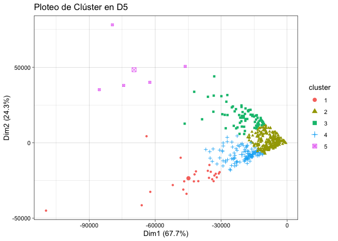<!-- -->

``` r
fviz_cluster  (D9,  Datos_Wholesale,  geom  =  "point", 
               stand  =FALSE,  ellipse.type =  "Euclid", pointsize = 1.3, 
               labelsize = 15, main = "Ploteo de Clúster en D9", 
               xlab = NULL, ylab = NULL, ggtheme = theme_linedraw())
```

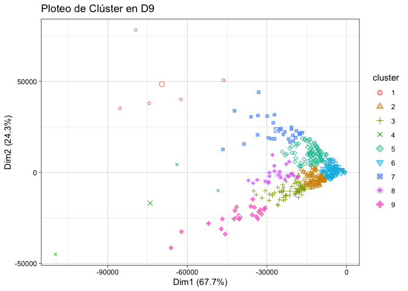<!-- -->

**b) ¿Cuántos conglomerados utilizaría para este conjunto de datos?
Justifique su respuesta:**

Para la elección óptima de un conglomerado, se debe elegir un criterio,
este criterio permite identificar el valor óptimo de k, el cual es uno
de los mayores problemas al utilizar el método k-means. De todos los
métodos utilizables para identificar este valor, se ha seleccionado el
método elbow (se usa generalmente cuando la mejora es menor a un % del
total inicial).

De los cálculos anteriores, podemos reconocer el whitinss, que simboliza
las variaciones, si efectuamos una suma total de las variaciones dentro
de cada grupo y conocer sus diferencias, podremos aplicar el método
elbow.

Para obtener el valor de k, lo realizaremos primero por un método de
cálculo mediante comandos de R y posteriormente mediante un método
gráfico:

``` r
tots = c(D1$tot.withinss,
         D2$tot.withinss,
         D3$tot.withinss,
         D4$tot.withinss,
         D5$tot.withinss,
         D6$tot.withinss,
         D7$tot.withinss,
         D8$tot.withinss,
         D9$tot.withinss,
         D10$tot.withinss) 
# determinados suma de los cuadrados (Total within-cluster sum of squares).
diferencias = tots[1:9] - tots[2:10]
porcentajes = diferencias/tots[1]
tots
#>  [1] 157595857166 113217528521  80332413843  64855545528  53116919401
#>  [6]  47498513492  41922735726  36273469993  36490689127  31081799417
```

En este análisis, a partir de 3 clusters la reducción en la suma total
de cuadrados internos parece estabilizarse, indicando que K = 3 es una
buena opción.

Por otra parte, al aplicar el método gráfico y señalando una línea
demarcada en el análisis anterior, obtenemos lo siguiente:

``` r
fviz_nbclust  (Datos_Wholesale,  kmeans,  method  =  "wss")  +
geom_vline(xintercept  =  3,  linetype  =  5)  +    labs(subtitle  =  "Método del Codo")
```

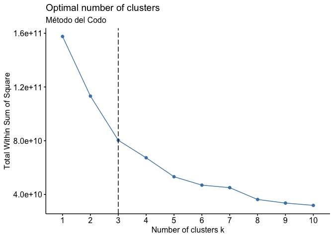<!-- -->

En el gráfico, podemos observar que el inicio del codo se produce justo
en **k=3**, lo cual concuerda con lo obtenido anteriormente.

De acuerdo a lo planteado, distintos criterios usados pueden hacer
variar el k, en el ejemplo siguiente se muestra la variación de
porcentajes y su incidencia en el k.

``` r
plot(porcentajes)
lines(rep(0.1, 10), type = 'l', col = 'red') # 10 %
lines(rep(0.05, 10), type = 'l', col = 'blue') # 5 %
lines(rep(0.01, 10), type = 'l', col = 'green') # 1 %
```

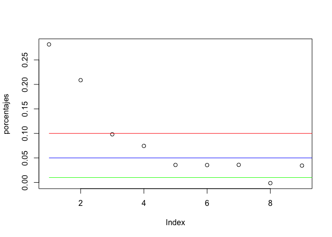<!-- -->

Dado que cualquier método que se use no entrega el k óptimo de manera
objetiva, se usará la función NbClust(), para determinar cual es el
mejor k dentro de un universo de 20 métodos, lo cual se realiza en el
siguiente cuadro de comandos:

``` r
library("NbClust")
nb  <-  NbClust(Datos_Wholesale,  distance  =  "euclidean",  
                min.nc  =  2,  max.nc  = 10,  method  =  "kmeans")
```

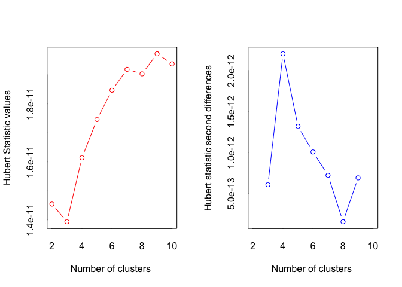<!-- -->

    #> *** : The Hubert index is a graphical method of determining the number of clusters.
    #>                 In the plot of Hubert index, we seek a significant knee that corresponds to a 
    #>                 significant increase of the value of the measure i.e the significant peak in Hubert
    #>                 index second differences plot. 
    #> 

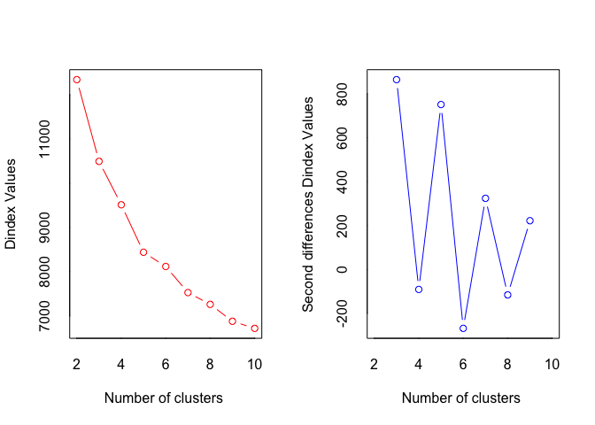<!-- -->

    #> *** : The D index is a graphical method of determining the number of clusters. 
    #>                 In the plot of D index, we seek a significant knee (the significant peak in Dindex
    #>                 second differences plot) that corresponds to a significant increase of the value of
    #>                 the measure. 
    #>  
    #> ******************************************************************* 
    #> * Among all indices:                                                
    #> * 5 proposed 2 as the best number of clusters 
    #> * 7 proposed 3 as the best number of clusters 
    #> * 2 proposed 4 as the best number of clusters 
    #> * 3 proposed 5 as the best number of clusters 
    #> * 3 proposed 8 as the best number of clusters 
    #> * 1 proposed 9 as the best number of clusters 
    #> * 3 proposed 10 as the best number of clusters 
    #> 
    #>                    ***** Conclusion *****                            
    #>  
    #> * According to the majority rule, the best number of clusters is  3 
    #>  
    #>  
    #> *******************************************************************

De lo anterior, podemos concluir que de todos los índices presentados,
hay 7 que proponen al k=3 como el valor óptimo.

Con la siguiente función se efectúa la determinación del óptima en una
tabla de frecuencia que combina la relación de todos los indices.

``` r
library("factoextra") 
fviz_nbclust(nb)
#> Warning in if (class(best_nc) == "numeric") print(best_nc) else if
#> (class(best_nc) == : the condition has length > 1 and only the first element
#> will be used
#> Warning in if (class(best_nc) == "matrix") .viz_NbClust(x, print.summary, : the
#> condition has length > 1 and only the first element will be used
#> Warning in if (class(best_nc) == "numeric") print(best_nc) else if
#> (class(best_nc) == : the condition has length > 1 and only the first element
#> will be used
#> Warning in if (class(best_nc) == "matrix") {: the condition has length > 1 and
#> only the first element will be used
#> Among all indices: 
#> ===================
#> * 2 proposed  0 as the best number of clusters
#> * 5 proposed  2 as the best number of clusters
#> * 7 proposed  3 as the best number of clusters
#> * 2 proposed  4 as the best number of clusters
#> * 3 proposed  5 as the best number of clusters
#> * 3 proposed  8 as the best number of clusters
#> * 1 proposed  9 as the best number of clusters
#> * 3 proposed  10 as the best number of clusters
#> 
#> Conclusion
#> =========================
#> * According to the majority rule, the best number of clusters is  3 .
```

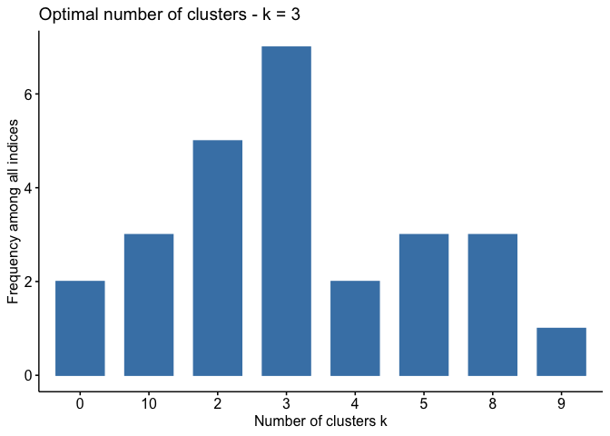<!-- -->

**c) Realice un gráfico de dispersión con las variables fresh y grocery,
identificando colores y/o figuras, el grupo al que pertenece cada
observación. Comente como se comportan los conglomerados de acuerdo a
estas dos variables (Ej: rango de valores, variabilidad, extremos,
etc…)**

De acuerdo al resultado anterior, se obtuvo el valor óptimo de k=3,
usando este valor, se realizará un análisis de los atributos Fresh y
Grocery, de acuerdo al siguiente código de ingresos de comando.

``` r
Fresh =  Datos_Wholesale$Fresh 
Grocery  =  Datos_Wholesale$Grocery
plot(Fresh,Grocery,col= c("red",  "blue",  "green")[D3$cluster])
```

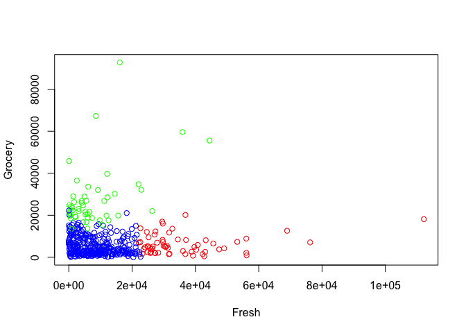<!-- -->

De lo anterior, podemos obtener los subgrupos, usando el k=3 por regla
del 10%, de acuerdo a lo siguiente:

``` r
# Para obtener subgrupo, usamos k = 3 por regla de 10 %
indices = D3$cluster
subgrupo1 = subset(Datos_Wholesale, indices == 1)
summary(subgrupo1)
#>      Fresh             Milk          Grocery          Frozen     
#>  Min.   : 22096   Min.   :  286   Min.   :  471   Min.   :  127  
#>  1st Qu.: 26294   1st Qu.: 2054   1st Qu.: 2576   1st Qu.: 1365  
#>  Median : 30818   Median : 3954   Median : 5058   Median : 3662  
#>  Mean   : 35941   Mean   : 6044   Mean   : 6289   Mean   : 6714  
#>  3rd Qu.: 40371   3rd Qu.: 7160   3rd Qu.: 8260   3rd Qu.: 8871  
#>  Max.   :112151   Max.   :43950   Max.   :20170   Max.   :60869  
#>  Detergents_Paper   Delicassen     
#>  Min.   :  10.0   Min.   :    3.0  
#>  1st Qu.: 272.8   1st Qu.:  949.5  
#>  Median : 511.5   Median : 1535.5  
#>  Mean   :1039.7   Mean   : 3049.5  
#>  3rd Qu.:1116.5   3rd Qu.: 2880.2  
#>  Max.   :5058.0   Max.   :47943.0
dim(subgrupo1)
#> [1] 60  6
sd(subgrupo1$Fresh)
#> [1] 15234.9
sd(subgrupo1$Grocery)
#> [1] 4629.034
```

De lo anteriormente expuesto (figura y cuadro resumen) se observa que el
primer clúster (Rojo), concentrando solo 60 observaciones, se muestra
disperso y poco compacto. Al analizar los productos frescos en el
clúster 1, se tiene que el promedio de gastos mensuales es de **30.818
USD**, donde el **gasto mínimo registrado es de 22096 USD y el máximo es
de 112151 USD**. Además, se distingue que el 25% de los clientes que
adquieren estos productos, gastan hasta 26.294 USD, mientras que el 75%
gasta hasta 40.371 USD. La *desviación estándar* obtenida corresponde a
**15239.9**, lo que se aleja del promedio de 30818 USD, determinando que
es mayor la dispersión de datos.

Al analizar los comestibles en el clúster 1, se tiene que el promedio de
gastos mensuales es de 6.289 USD, donde el gasto mínimo registrado es de
471USD y el máximo es de 20170 USD. Además, se distingue que el 25% de
los clientes que adquieren estos productos, gastan hasta 2576 USD,
mientras que el 75% gasta hasta 8260 USD. La desviación estándar
obtenida corresponde a 4629.03, determinando menor dispersión para este
producto en este clúster.

``` r
indices = D3$cluster
subgrupo2 = subset(Datos_Wholesale, indices == 2)
summary(subgrupo2)
#>      Fresh            Milk          Grocery          Frozen       
#>  Min.   :    3   Min.   :   55   Min.   :    3   Min.   :   25.0  
#>  1st Qu.: 2867   1st Qu.: 1278   1st Qu.: 2002   1st Qu.:  660.2  
#>  Median : 7149   Median : 2846   Median : 3444   Median : 1391.0  
#>  Mean   : 8253   Mean   : 3825   Mean   : 5280   Mean   : 2572.7  
#>  3rd Qu.:12372   3rd Qu.: 5762   3rd Qu.: 7812   3rd Qu.: 3129.5  
#>  Max.   :22686   Max.   :18664   Max.   :22272   Max.   :35009.0  
#>  Detergents_Paper    Delicassen   
#>  Min.   :    3.0   Min.   :    3  
#>  1st Qu.:  232.5   1st Qu.:  364  
#>  Median :  646.5   Median :  774  
#>  Mean   : 1773.1   Mean   : 1137  
#>  3rd Qu.: 2951.0   3rd Qu.: 1540  
#>  Max.   :10069.0   Max.   :14472
dim(subgrupo2)
#> [1] 330   6
sd(subgrupo2$Fresh)
#> [1] 6194.182
sd(subgrupo2$Grocery)
#> [1] 4370.73
```

Por otro lado, el segundo clúster (azul) es bastante compacto,
conteniendo la menor cantidad de observaciones equivalentes a 50.

Al analizar los productos frescos en el clúster 2, se tiene que el
promedio de gastos mensuales es de **5407 USD**, donde el **gasto mínimo
registrado es de 85 USD y el máximo es de 44466 USD**. Además, se
distingue que el 25% de los clientes que adquieren estos productos,
gastan hasta 1764 USD, mientras que el 75% gasta hasta 11088 USD. La
*desviación estándar* obtenida corresponde a **9124.6**, lo que es mayor
que el promedio, determinando mayor dispersión para los productos
frescos en este clúster. Al analizar los comestibles en el clúster 2, se
tiene que el promedio de gastos mensuales es de 14520 USD, donde el
gasto mínimo registrado es de 13567 USD y el máximo es de 92780 USD.
Además, se distingue que el 25% de los clientes que adquieren estos
productos, gastan hasta 19808 USD, mientras que el 75% gasta hasta 28970
USD. La desviación estándar obtenida corresponde a 14515.7, lo que es un
poco menor que el promedio.

``` r
indices = D3$cluster
subgrupo3 = subset(Datos_Wholesale, indices == 3)
summary(subgrupo3)
#>      Fresh            Milk          Grocery          Frozen       
#>  Min.   :   85   Min.   : 3737   Min.   :13567   Min.   :   33.0  
#>  1st Qu.: 1764   1st Qu.:11094   1st Qu.:19808   1st Qu.:  791.5  
#>  Median : 5407   Median :14520   Median :22710   Median : 1254.0  
#>  Mean   : 8000   Mean   :18511   Mean   :27574   Mean   : 1996.7  
#>  3rd Qu.:11088   3rd Qu.:21998   3rd Qu.:28970   3rd Qu.: 2553.8  
#>  Max.   :44466   Max.   :73498   Max.   :92780   Max.   :10155.0  
#>  Detergents_Paper   Delicassen     
#>  Min.   :  282    Min.   :    3.0  
#>  1st Qu.: 7371    1st Qu.:  719.8  
#>  Median :10768    Median : 1437.5  
#>  Mean   :12407    Mean   : 2252.0  
#>  3rd Qu.:14690    3rd Qu.: 2793.2  
#>  Max.   :40827    Max.   :16523.0
dim(subgrupo3)
#> [1] 50  6
sd(subgrupo3$Fresh)
#> [1] 9124.631
sd(subgrupo3$Grocery)
#> [1] 14515.78
```

Finalmente, el tercer grupo (verde), es el que posee mayor cantidad de
observaciones =330. Al analizar los productos frescos en el clúster 3,
se tiene que el promedio de gastos mensuales es de **8253 USD**, donde
el **gasto mínimo registrado es de 3 USD y el máximo es de 22686 USD**.
Además, se distingue que el 25% de los clientes que adquieren estos
productos, gastan hasta 2867 USD, mientras que el 75% gasta hasta 12372
USD. La *desviación estándar* obtenida corresponde a **6194.1**, lo que
es menor al promedio, determinando menor dispersión para este producto
en este clúster. Al analizar los comestibles en el clúster 3, se tiene
que el promedio de gastos mensuales es de 3444 USD, donde el gasto
mínimo registrado es de 3 USD y el máximo es de 22272 USD. Además, se
distingue que el 25% de los clientes que adquieren estos productos,
gastan hasta 2002 USD, mientras que el 75% gasta hasta 7812 USD. La
desviación estándar obtenida corresponde a 4370.7, lo que es mayor que
el promedio, determinando mayor dispersión para este producto.

## REFERENCIAS:

1.  Horton, Bob (2016) ROC Curves in Two Lines of R Code. Sitio:
    Revolution Analytics. \[en línea\] Recuperado de:
    <https://blog.revolutionanalytics.com/2016/08/roc-curves-in-two-lines-of-code.html>
2.  Narkhede, Sarang (2018) Understanding AUC - ROC Curve. Sitio Towards
    Data Science. \[en línea\] Recuperado de:
    <https://towardsdatascience.com/understanding-auc-roc-curve-68b2303cc9c5>
3.  Narkhede, Sarang (2018) Understanding Confusion Matrix. Sitio:
    Towards Data Science. \[en línea\] Recuperado de:
    <https://towardsdatascience.com/understanding-confusion-matrix-a9ad42dcfd62>
4.  Von, Cambridge (2014) FRR, FAR, TPR, FPR, ROC curve, ACC, SPC, PPV,
    NPV. Sitio: Blog Cambridge \[en línea\] Recuperado de:
    <https://cambridge-archive.blogspot.com/2014/04/frr-far-tpr-fpr-roc-curve-acc-spc-ppv.html>
